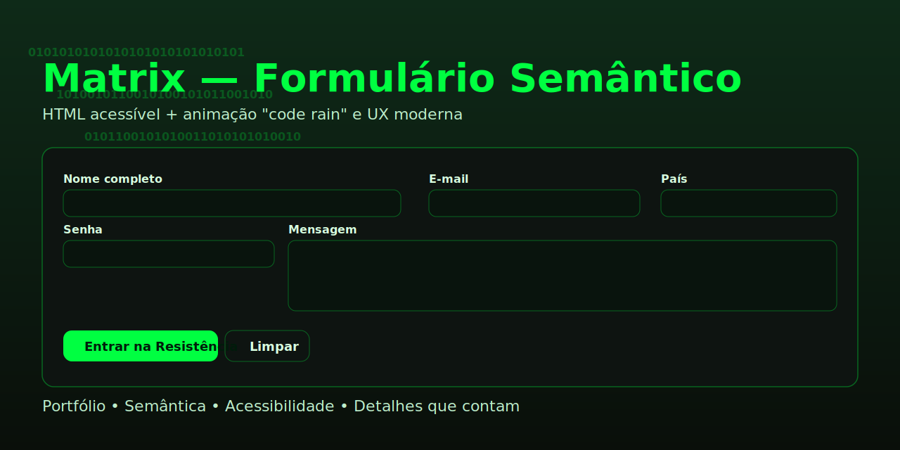

# Matrix — Formulário Semântico

[](https://github.com/matheussiqueirahub/elementos-html-semantico-e-formulario/actions/workflows/deploy-pages.yml)

Uma landing minimalista com formulário de cadastro, escrita com HTML semântico, acessibilidade real e um visual sutil inspirado em Matrix. O foco é demonstrar domínio de marcação correta, boas práticas de UX e pequenos detalhes de front-end que contam pontos em projetos profissionais.

• Live demo: https://matheussiqueirahub.github.io/elementos-html-semantico-e-formulario/



## Destaques

- Semântica: `header`, `nav`, `main`, `section`, `fieldset`, `legend`, `footer`.
- Acessibilidade: rótulos associados, `aria-live` para feedback, foco visível, skip link, `prefers-reduced-motion` respeitado.
- Formulário completo: nome, e‑mail, senha, país (select), mensagem (textarea) e botões de enviar/limpar.
- Validações nativas + UX: mensagens amigáveis, contador de caracteres e persistência local (localStorage).
- Visual Matrix: animação de code rain (canvas) discreta, tipografia monoespaçada e acentos neon.

## Estrutura

- `index.html` — marcação semântica e acessível.
- `styles.css` — tema Matrix, alto contraste, responsivo.
- `script.js` — code rain, validações e pequenos detalhes de UX.

## Como rodar localmente

1. Abra o arquivo `index.html` no navegador.
2. Opcional: sirva com um HTTP server simples (ex.: `npx serve`), mas não é obrigatório.

## Publicar no GitHub Pages

Crie um repositório no seu GitHub (ex.: `matrix-form`). Depois, dentro da pasta `matrix-form`:

```bash
git init
git add .
git commit -m "feat: formulário semântico Matrix + animação e acessibilidade"
git branch -M main
git remote add origin https://github.com/SEU_USUARIO/matrix-form.git
git push -u origin main
```

No repositório no GitHub: Settings → Pages → Build and deployment → Source: `Deploy from a branch` → `main` → `/ (root)` e salve. A URL ficará algo como `https://SEU_USUARIO.github.io/matrix-form/`.

## Personalização rápida

- Título e textos: edite no `index.html`.
- Cores: ajuste as variáveis CSS em `styles.css` (ex.: `--accent`).
- Animação: para desabilitar permanentemente o code rain, remova a chamada `startMatrixRain()` no `script.js`.

## Publicação via GitHub Actions

Este repositório publica automaticamente a pasta `matrix-form` no GitHub Pages usando GitHub Actions.

- Workflow: `.github/workflows/deploy-pages.yml`
- Gatilhos: push na branch `main` e `workflow_dispatch`
- Caminho publicado: `matrix-form`

Para reutilizar em outro repositório, copie o workflow e ajuste o campo `with.path` para a pasta do seu site estático.

---

Feito com carinho pela web aberta. Divirta‑se! 🟩

## Tópicos (tags) sugeridos

Adicione estes tópicos no repositório para melhorar a descoberta:

`html`, `css`, `javascript`, `semantic-html`, `accessibility`, `a11y`, `forms`, `github-pages`, `portfolio`, `matrix`, `canvas`, `web-standards`, `frontend`.

Se preferir via GitHub CLI (após `gh auth login`):

```bash
gh repo edit matheussiqueirahub/nucleo-comercial-dados \
  --add-topic html --add-topic css --add-topic javascript \
  --add-topic semantic-html --add-topic accessibility --add-topic a11y \
  --add-topic forms --add-topic github-pages --add-topic portfolio \
  --add-topic matrix --add-topic canvas --add-topic web-standards --add-topic frontend
```
